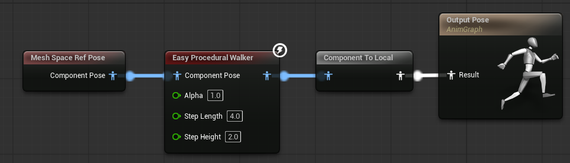
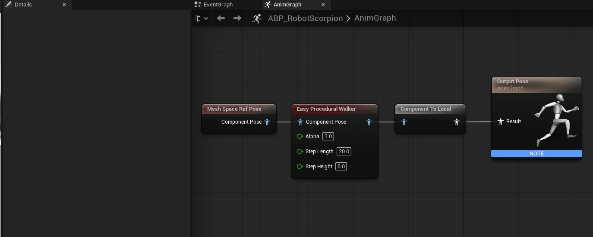
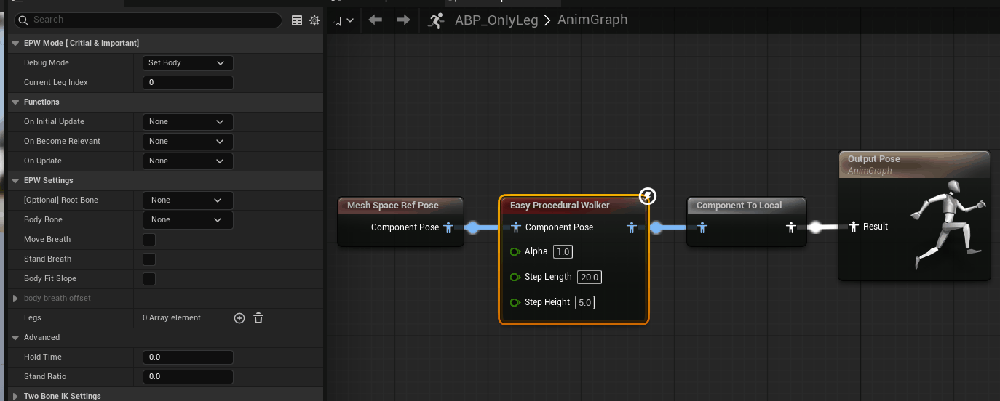
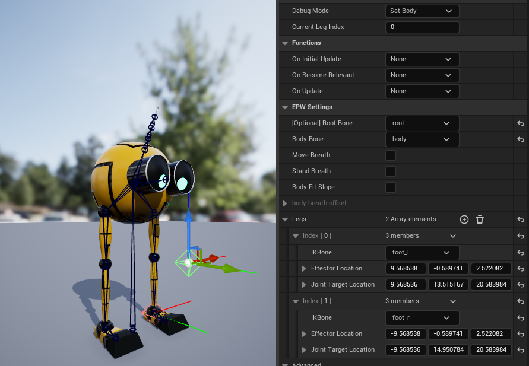

# 1. Introduction

EasyProceduralWalker is a simple UE plugin for multi-legged creature locomotion. Built on TwoBoneIK, it is limited to driving only two bones (three joints) per leg. 
Before you use the plugin, you must know how to set a TwoBoneIK node for one leg

# 2. Usage
Create an “Easy Procedural Walker” node in your AnimGraph, and connect to “Mesh Space Ref Pose” node as input and “Output Pose” as output 

In the “Details” pannel, there are thre mode: 
- **SetBody mode**: set up your two bone ik parameters for each leg 
- **AnimBP Preview mode**: Use a root motion to preview the result 
- **Game Play mode**: Play in your scene

## 2.1 SetBody

1. In `EPW Mode [critical & Important]` tab
 - "Debug Mode": Set Body
 - "Current Leg Index": 0

2. In `EPW Settings` tab
- Setup "Root Bone" and “Body Bone”

- Add leges and set the "IKBone"、"Effector Location" and "Joint Target Location" individually
    - IKBone: the end bone for your leg always known as foot
    - Effector Location: the global position of the end joint    
    - Joint Target Location: the global position where the middle joint aim at.

> Open your SkeletalMesh asset and copy the gobal position and paste to the corresponding joint Location.
{: .prompt-tip }

The final result for the left leg should look like

3. In `EPW Step Settings` tab
- If your foot has heel/shoes, enable `Set Default Heel Height` and set the heel height for each leg in `Default Heel Height`
- If you want some legs move at the same time period, enable `Set Timings Manually` and set a float number for each leg. 
    - Example: Number $0.3$ means the leg belongs to the $0$ group and will move at 30% total time. total time means how long will it take during finishing one step
- Timings Offset: Only one leg in each group by default.

> Only the legs in the last group both finish moving, the lges in the next group will start move. The integer part defines which group the leg belongs to, while the fractional part defines the percentage of the group's cycle at which that leg starts to move.
{: .prompt-info }

4. In `EPW Trace`
- Show Predict Pos: Show the next target position for each foot and the predicted Joint Target Location too.
- Show Line Ray: For debuging Line Ray Tracing
- Show Sphere Hitter: For debuging Sphere Tracing
