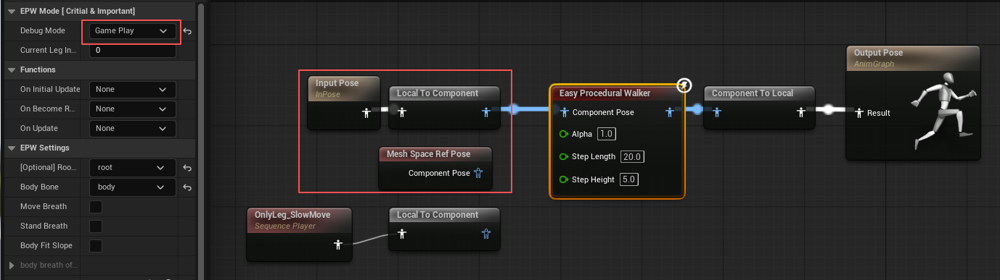
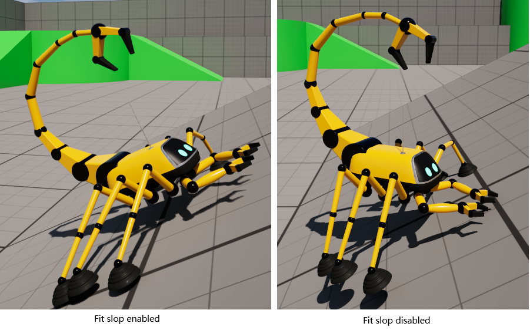
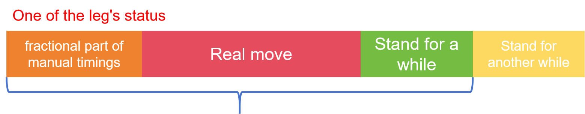
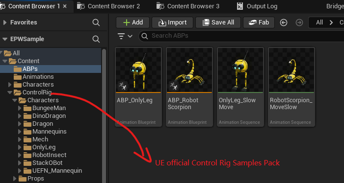

## 1. Introduction

EasyProceduralWalker is a simple UE plugin for multi-legged creature locomotion. Built on TwoBoneIK, it can drive only two bones (three joints) per leg.  
Before using the plugin, you need to know how to set up a TwoBoneIK node for a single leg.

## 2. Usage
Create an “Easy Procedural Walker” node in your AnimGraph, connect its input to the “Mesh Space Ref Pose” node, and connect its output to the “Output Pose” node.

In the **Details** panel there are three modes:  
- **SetBody**: configure the two-bone-IK parameters for each leg  
- **AnimBP Preview**: use root motion to preview the results  
- **Game Play**: play in the level

### 2.1 SetBody

**Step 1: In the `EPW Mode [Critical & Important]` tab**  
- Set **Debug Mode** to *SetBody*  
- Set **Current Leg Index** to *0* which means show the first leg's TwoBoneIK debug UI.

**Step2: In `EPW Settings` tab**
- Set **Root Bone** and **Body Bone**

- To add each leg, first adjust the **Current Leg Index**​ to the corresponding number. Then, set its `IKBone`, `Effector Location`, and `Joint Target Location`.
  - **IKBone**: the end bone of the leg (usually the foot)  
  - **Effector Location**: the world-space position of the foot joint  
  - **Joint Target Location**: the world-space point the middle joint aims at

> Open your Skeletal Mesh asset, copy the global position, and paste it into the corresponding joint location. Move the JointTargetLocation well away from the middle joint.
{: .prompt-tip }

The final result for the left leg should look like this.

**Step3. In `EPW Step Settings` tab**
- If the foot has a heel or shoe, enable **Set Default Heel Height** and enter the heel height for each leg in **Default Heel Height**.  
- To make several legs move in the same time slot, enable **Set Timings Manually** and assign a float to each leg.  
  - Example: the value 0.3 puts the leg in group 0 and makes it start moving at 30 % of that group’s cycle (one complete step).  
- **Timings Offset**: By default it is 1, which means only one leg is defined per group.

> The next group starts only after every leg in the previous group has finished. The integer part of the value sets the group; the fractional part sets when, within that group’s cycle, the leg begins to move.
{: .prompt-info }

**Step 4. In `EPW Trace`**  
- **Show Predict Pos**: display the next target position for each foot and the predicted joint-target location.  
- **Show Line Ray**: toggle line-trace debugging.  
- **Show Sphere Hitter**: toggle sphere-trace debugging.

### 2.2 AnimBP Preview

Create a test animation asset that moves only the root bone.

Switch to **AnimBP Preview** mode and plug the animation into the **Easy Procedural Walker** node in the AnimGraph.

> In this step, create animations at different speeds and adjust **Step Length** and **Step Height** to suitable values.
{: .prompt-tip }

### 2.3 Game Play

If you move the avatar in the game scene, reconnect the node to **Mesh Space Ref Pose** (or **Input Pose**) and set **Debug Mode** to **Game Play**.

## 3. Other parameters

In the `EPW Settings` tab  
- `Move breath`: The body moves up and down in sync with each step.  
- `Stand breath`: The body gently rises and falls while standing still.  
  - Remember to set the `body breath offset`

- `Body Fit slope`: The body automatically tilts to match the slope angle as it moves.

> Robots with two legs generally don’t need to enable `Body Fit slope`; the parameter is more suitable for multi-legged insects.
{: .prompt-tip }

- Advanced `Hold Time` `Stand Ratio` \
Mainly used for controlling the stand time.

> For example, if moving the second leg a certain distance takes 1 s, but its `Manual Timing` is set to 1.2 (group 1 with a 20 % delayed start), `Stand Ratio` to 0.2 (20 %), and `Hold Time` to 0.5s, then the step starts at 0.2s, moves from 0.2s to 0.8s, stands for the remaining 0.2s, and must stay in place for an additional 0.5 s.
{: .prompt-tip }

> You should rarely change these two advanced parameters, as doing so may cause unexpected movements.
{: .prompt-danger }

## Examples
In UE 5.7, first import the [**Control Rig Samples Pack**](https://www.fab.com/listings/2ce3fe44-9ee6-4fa7-99fc-b9424a402386) into your project.  

Next, unzip the provided archive into your **Content** folder; you will obtain two Animation Blueprints for `SKM_OnlyLeg` and `SKM_RobotScorpion`, along with sample animations.:https://1drv.ms/u/c/53c607b8bea23158/IQC8ji7fVj5-Qb8Rt45PIUrnAZSZsfDkAkWgUinfEjlJ1sk?e=wAusGU

> The Animation blueprint use AnimBP Preview mode by default. If you want to use the ThirdPerson template, please change to GamePlay mode and assign the SkeletalMesh and corresponding ABP to your `BP_ThirdPersonCharacter.uasset` and adjuest the `max walk speed` in this CharacterBP.
{: .prompt-info }

