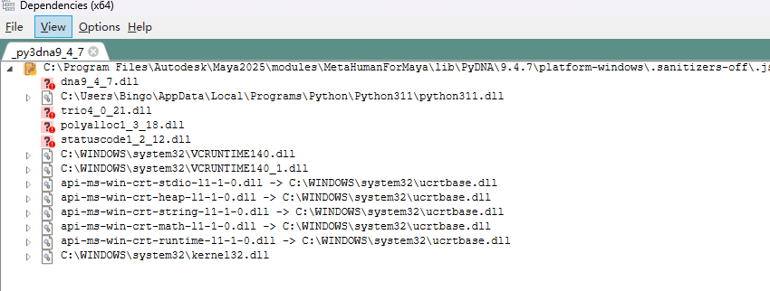
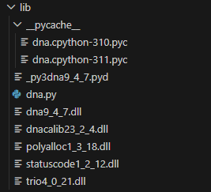

> **更新说明（2026-06-25）**：本文前半部分记录的是 UE5.6/5.7 时代的方案（从 Maya 插件提取 DNA 库），**仅作历史参考**。UE5.8 带来了全新的 DNA 工具链，包括 **OpenRigLogic（MIT 开源）**、**引擎内建 DNACalibLib**、以及 **独立的 DNA Asset 类型**。如果你使用的是 UE5.8+，请直接跳到 [第 3 节](#3-ue58-新纪元-openriglogic--dnacaliblib)。

## 1. Introduction（UE5.5-5.7 时代背景）

Epic 的官方开源库 [MetaHuman-DNA-Calibration](https://github.com/EpicGames/MetaHuman-DNA-Calibration) 仅支持旧版 DNA 文件。

在 UE 5.6 以后的版本中，新创建的 DNA 文件只能通过 [MetaHumanForMaya](https://www.fab.com/listings/9e3bf55e-d4c3-44fc-a3d4-ec4cb772ec29) 插件来加载。

> ⚠️ **2025年6月更新**：`MetaHuman-DNA-Calibration` 仓库已正式声明不再支持 UE5.6+ 创建的角色，仅兼容 UE5.5 及更早版本。

如果我们想在独立 Python 脚本中（不依赖 Maya）使用 DNA 文件，就需要深入研究这个插件。

## 2. UE5.7 方案：从 Maya 插件提取 DNA 库

### 2.1 MetahumanForMaya 安装回顾

1. 从 [MetaHumanForMaya](https://www.fab.com/listings/9e3bf55e-d4c3-44fc-a3d4-ec4cb772ec29) 下载插件
2. 将 `MAYA_MODULE_PATH` 添加到系统环境变量，值指向 `C:\Program Files\Autodesk\Maya2025\modules`
3. 将下载的 zip 解压到 `C:\Program Files\Autodesk\Maya2025\modules`
4. 参考 [官方文档](https://dev.epicgames.com/documentation/en-us/metahuman/installing-in-maya) 将插件安装进 Maya

### 2.2 定位核心脚本

核心脚本位于：
`C:\Program Files\Autodesk\Maya2025\modules\MetaHumanForMaya\lib\PyDNA\9.4.7\platform-windows\.sanitizers-off\.json-0`

Maya 2025 使用 Python 3.11.4，所以将对应版本的库从 `python-3.11` 文件夹复制出来即可。

### 2.3 独立导入尝试

```python
import os
import sys

ROOT = os.path.dirname(__file__)
LIB  = os.path.join(ROOT, "lib")

sys.path.insert(0, LIB)
os.add_dll_directory(LIB)

import dna
```

首次导入会报错：

```sh
E:\Code\python\PyQT\lib>python test.py
Traceback (most recent call last):
  File "E:\Code\python\PyQT\lib\test.py", line 10, in <module>
    import dna
  File "E:\Code\python\PyQT\lib\dna.py", line 35, in <module>
    import _py3dna9_4_7
ImportError: DLL load failed while importing _py3dna9_4_7: 找不到指定的模块。
```

### 2.4 解决 DLL 依赖

`_py3dna9_4_7.pyd` 需要额外的 DLL 支持。使用第三方工具 [Dependencies](https://github.com/lucasg/Dependencies/releases) 进行检测：



可以看到 `_py3dna9_4_7.pyd` 依赖：
- `dna9_4_7.dll`
- `polyalloc1_3_18.dll`
- `statuscode1_2_12.dll`
- `trio4_0_21.dll`

将这些 DLL 全部复制到同一文件夹后，`import dna` 即可正常运行。

### 2.5 最终独立运行包结构



---

## 3. UE5.8 新纪元：OpenRigLogic + DNACalibLib

UE5.8（2026年6月发布，UE5 最后一个大版本）对 MetaHuman DNA 工具链进行了**彻底重构**。以下是所有关键变化。

### 3.1 OpenRigLogic — MIT 开源 DNA/RigLogic 库

**这是 UE5.8 最大的变化**：Epic 将 RigLogic 和 DNA 库以 **MIT 许可证** 在 GitHub 上开源：

> 🔗 [github.com/EpicGames/OpenRigLogic](https://github.com/EpicGames/OpenRigLogic)

核心特性：
- **原生 C++ 库 + Python 绑定**：同时提供 C++ API 和 Python wrapper
- **MIT 许可证**：可以自由集成到任何项目（包括商业项目），不再依赖 Maya 或 UE
- **完整 DNA 读写能力**：`BinaryStreamReader` / `BinaryStreamWriter` / `JSONStreamReader` / `JSONStreamWriter` 全部可用
- **RigLogic 运行时**：提供与 UE 引擎内完全一致的 Rig 评估能力
- **这是 MetaHuman Devkit 的起点**，旨在让 MetaHuman 技术可以在 UE 之外的任何平台使用

#### 编译 Python Wrapper

```shell
git clone https://github.com/EpicGames/OpenRigLogic.git
cd OpenRigLogic
make build
cd build
cmake .. -DRL_BUILD_PYTHON_WRAPPER=3.14 -DCMAKE_BUILD_TYPE=Release
cmake --build . --config Release
cmake --install . --prefix E:/Code/UnrealEngine/Plugins/SourceCode/OpenRigLogic/install --config Release
```

#### 安装到 Python

编译完成后，将生成的 4 个文件复制到 Python 的 `site-packages`：

```shell
cp "E:/Code/UnrealEngine/Plugins/SourceCode/OpenRigLogic/install/lib/dna.py" \
   "C:/Users/zb116/AppData/Local/Programs/Python/Python314/Lib/site-packages/"
cp "E:/Code/UnrealEngine/Plugins/SourceCode/OpenRigLogic/install/lib/riglogic.py" \
   "C:/Users/zb116/AppData/Local/Programs/Python/Python314/Lib/site-packages/"
cp "E:/Code/UnrealEngine/Plugins/SourceCode/OpenRigLogic/install/lib/_py3dna13_2_7.pyd" \
   "C:/Users/zb116/AppData/Local/Programs/Python/Python314/Lib/site-packages/"
cp "E:/Code/UnrealEngine/Plugins/SourceCode/OpenRigLogic/install/lib/_py3riglogic13_2_7.pyd" \
   "C:/Users/zb116/AppData/Local/Programs/Python/Python314/Lib/site-packages/"
```

安装完成后可直接使用：

```python
import dna        # DNA 文件读取/写入
import riglogic   # RigLogic 运行时评估
```

> 🎉 **不再需要从 Maya 插件提取！不需要 Dependency Walker 找 DLL！**OpenRigLogic 编译出来后就是一个完整的、可独立使用的 DNA 库。

#### OpenRigLogic C++ 头文件结构

```
install/include/
├── dna/
│   ├── BinaryStreamReader.h      # 二进制 DNA 读取
│   ├── BinaryStreamWriter.h      # 二进制 DNA 写入 ✨ 新！
│   ├── JSONStreamReader.h        # JSON DNA 读取
│   ├── JSONStreamWriter.h        # JSON DNA 写入 ✨ 新！
│   ├── Reader.h / Writer.h       # 抽象读写接口
│   ├── Configuration.h           # 坐标系等配置
│   └── layers/                   # 各数据层读写接口
├── riglogic/
│   ├── RigLogic.h                # RigLogic 主类
│   ├── RigInstance.h             # Rig 实例
│   └── Configuration.h           # 计算精度等配置
├── trio/                         # 流/文件 IO
├── pma/                          # 内存分配
├── tdm/                          # 数学库（向量/四元数/矩阵/坐标系）
└── status/                       # 状态码
```

### 3.2 DNACalibLib — UE5.8 引擎内建 DNA 编辑

UE5.8 将 DNACalib 作为**引擎内置插件**（`/Engine/Plugins/Animation/DNACalib/`）直接提供，无需额外下载。提供的 C++ API 包括：

| 操作 | 类 | 说明 |
|------|-----|------|
| **重命名关节** | `RenameJointCommand` | 关节重命名 |
| **移除关节** | `RemoveJointCommand` | 带权重重映射的关节移除 |
| **清除 BlendShape** | `ClearBlendShapesCommand` | 移除全部 delta 和动画数据 |
| **缩放/旋转/平移** | `SetScaleCommand` 等 | 整体 Rig 变换 |
| **设置 LOD** | `SetLODsCommand` | 控制 LOD 数量 |
| **修改中性姿态** | — | 调整 Joint 中性位置/旋转 |

> ⚠️ `neck_01`、`neck_02`、`FACIAL_C_FacialRoot` 不能被移除或重命名——它们是头部连接身体的关键关节。

### 3.3 DNA Asset — 独立资产类型

UE5.7 及之前，DNA 数据作为 `AssetUserData` 附属在 SkeletalMesh 上（每个 Mesh 只能有一份 DNA 拷贝）。

UE5.8 将 **DNA 提升为独立的 Content Browser 资产**（`UDNA`），具有以下优势：

- **一份 DNA 可被多个 SkeletalMesh 共享**，不再冗余
- **可在编辑器中直接修改 DNA 配置**：LOD、数据层、坐标系、旋转约定、面朝向等
- **ConvertLegacyDNAAssets 命令行工具**：一键迁移旧版 DNA 资产到新类型
- **Cook 时优化序列化**：直接恢复初始化 Rig 状态，减少运行时开销

### 3.4 RigLogic 运行时优化

| 特性 | UE5.7 | UE5.8 |
|------|-------|-------|
| FP16 精度 | 仅移动端 | **桌面端（Windows/Linux）也支持** |
| 平台调优 | 全局统一 | **按平台配置**计算后端、浮点精度、ML 线程数 |
| 项目设置 | 无 | **RigLogic 插件设置页面**，统一管理默认值 |
| 坐标系转换 | 外部处理 | **库内建转换**，加载时自动完成 |
| 安全性 | 基础 | **解析器防恶意 DNA 文件** |

### 3.5 metaHuman-devkit-in-unreal-engine 官方文档

Epic 的 UE5.8 新文档：

> 🔗 [MetaHuman Devkit in Unreal Engine](https://dev.epicgames.com/documentation/metahuman/metahuman-devkit-in-unreal-engine)

该 Devkit 被定位为 **"不断演进的技术集合"**，目标是让 MetaHuman 角色技术可以脱离 UE 引擎使用。OpenRigLogic 是起点，未来还会有更多组件开源。

---

## 4. DNAUpdater 插件：UE5.8 编辑器中的 DNA 应用工具

笔者针对 UE5.8 的新 DNA Asset 体系开发了一个编辑器插件 [DNAUpdater](e:\Code\UnrealEngine\Plugins\SourceCode\DNAUpdater\Source\DNAUpdater\Private\DNAUpdater.cpp)，在 Content Browser 的 SkeletalMesh 右键菜单中添加 **"MetaHuman Updater"** 功能：

**核心功能：**

- **Update mesh with DNA file**：读取 `.dna` 文件，将 DNA 中的顶点位置、蒙皮权重、Morph Target 和骨骼信息写入 SkeletalMesh，并自动创建/更新 `UDNA` Asset 以支持 RigLogic 运行时评估
- **Add a blendshape**：将 OBJ 文件导入为新的 Morph Target

**依赖的 UE5.8 引擎模块：**

```csharp
// DNAUpdater.Build.cs
PublicDependencyModuleNames.AddRange(new string[] {
    "Core", "UnrealEd",
    "RigLogicModule",    // RigLogic 运行时
    "RigLogicLib",       // 底层 DNA C++ 库
    "DesktopPlatform",
    "MainFrame", "AppFramework",
});
```

插件基于 UE5.8 内建的 **RigLogic v4 API**（`rl4::Status`、`IDNAReader`、`FDNAConfig::Legacy()` 等），使用 `USkelMeshDNAUtils` 完成 DNA 到 SkeletalMesh 的顶点映射。

---

## 5. 总结：版本对比

| 特性 | UE5.5（旧） | UE5.6/5.7 | UE5.8 ✨ |
|------|-------------|-----------|----------|
| DNA 库来源 | GitHub [MetaHuman-DNA-Calibration](https://github.com/EpicGames/MetaHuman-DNA-Calibration) | Maya 插件独立提取 | **OpenRigLogic（MIT 开源）** |
| 许可证 | Epic 专有 | Epic 专有 | **MIT** |
| Python 绑定 | `dnacalib`（SWIG, Py3.7） | `dnacalib2`（Maya 附带） | **`dna` + `riglogic`（原生）** |
| DNA 写入 | ❌ 只读 | ❌ 只读 | ✅ **BinaryStreamWriter / JSONStreamWriter** |
| DNA Asset 类型 | AssetUserData | AssetUserData | ✅ **独立 UDNA Asset** |
| 坐标系统 | 手动转换 | 手动转换 | ✅ **库内建自动转换** |
| 桌面 FP16 | ❌ | ❌ | ✅ |
| 安装方式 | GitHub clone | 手动提取 DLL | ✅ **pip-style 直接 copy** |
