## 1. Introduction

The **ParallaxMappingMaterial** plugin is a C++ implementation of the free [Interior Mapping Shader](https://www.fab.com/listings/0790debf-d144-4523-a6e9-ee73a82ff30d) available on Fab.

The final result in-engine:

## 2. Usage

### 2.1 Background
#### 2.1.1 Nine-Grid Texture

If you're using a 9-grid texture atlas like this:

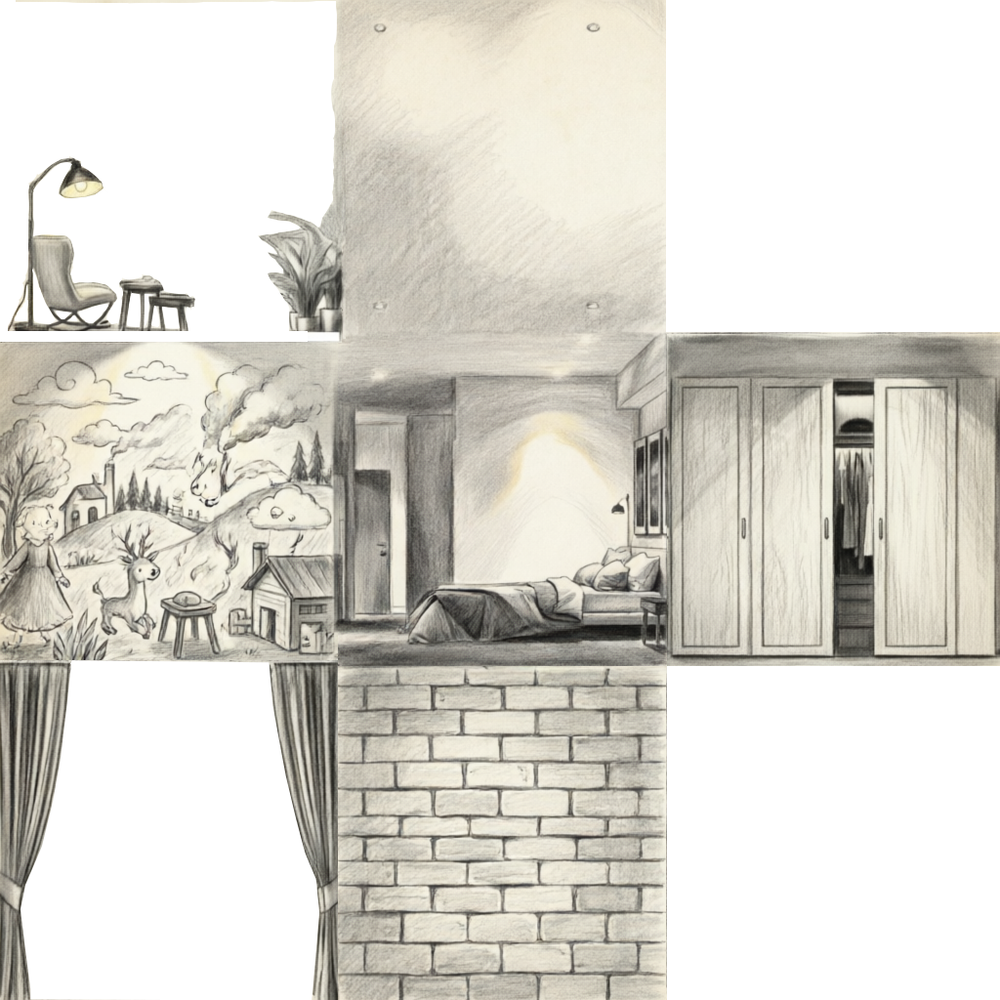

Drop an **Interior Mapping UV** node into your material graph.

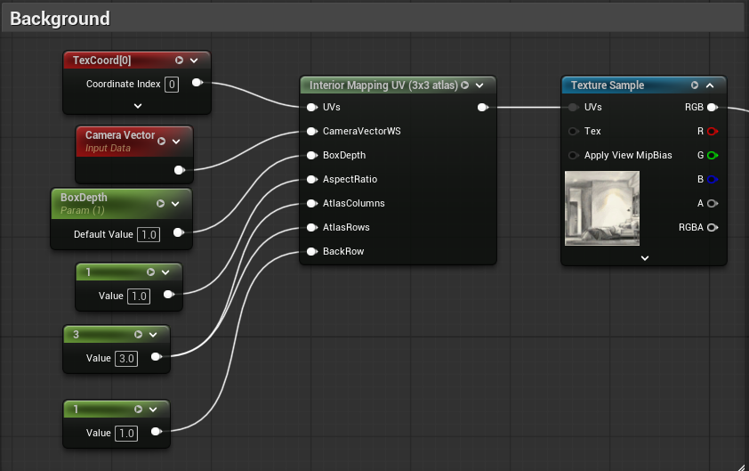

| Pin | Type | Description |
|-----|------|-------------|
| **Inputs** | | |
| `UVs` | `TexCoordinates` | UV coordinates. Defaults to `TexCoord[0]`. |
| `CameraVectorWs` | `Vector3` | Camera vector in world space. Use `CameraVectorWS` by default. |
| `BoxDepth` | `Scalar` | Depth of the virtual room. |
| `AspectRatio` | `Scalar` | $$\frac{Room_{Width}}{Room_{Height}}$$. Defaults to `1` (a cube-shaped room). |
| `AtlasColumns` | `Scalar` | Number of grid columns in the atlas. Defaults to `3`. |
| `AtlasRows` | `Scalar` | Number of grid rows in the atlas. Defaults to `3`. |
| `BackRow` | `Scalar` | Which row contains the back wall. Top row = `BackRow - 1`, bottom row = `BackRow + 1`. |
| **Outputs** | | |
| Return value | `Vector2` | The parallax-shifted UVs. Connect to the `UVs` pin of a `TextureSample` node. |

#### 2.1.2 One Texture Per Cell

If your textures are split into individual files:

- CenterTop:\
  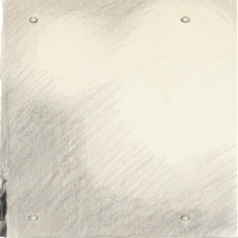
- CenterLeft:\
  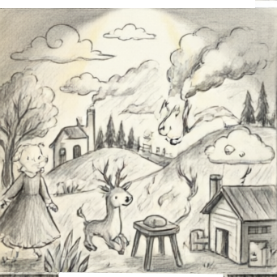
- Center:\
  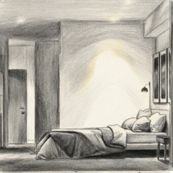
- CenterRight:\
  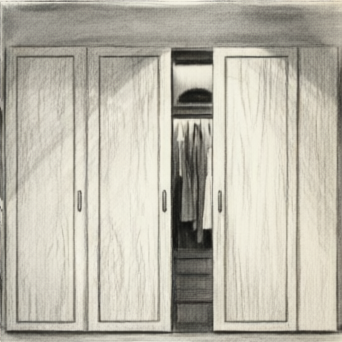
- CenterBottom:\
  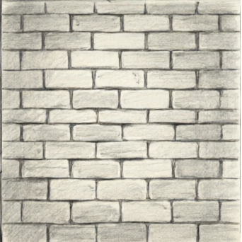

Use the **Atlas Composer** node to merge them into a single atlas, then feed its output into the `Interior Mapping UV` node.

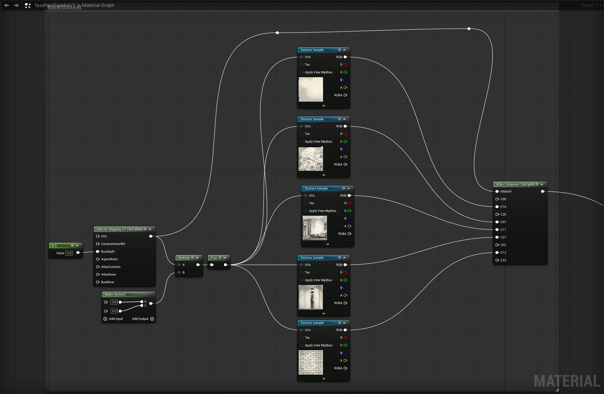

### 2.3 Foreground Elements

Use a **Billboard Layer UV** node to layer foreground elements with independent parallax.

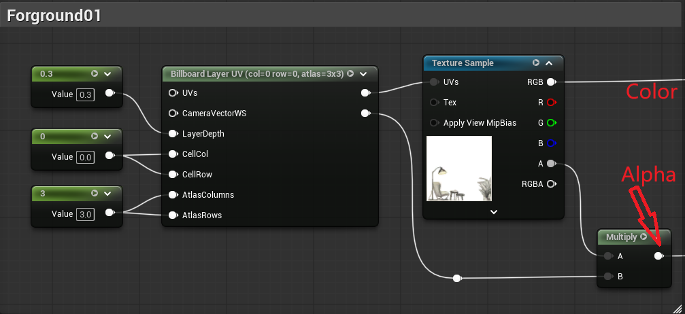

| Pin | Type | Description |
|-----|------|-------------|
| **Inputs** | | |
| `UVs` | `TexCoordinates` | UV coordinates. Defaults to `TexCoord[0]`. |
| `CameraVectorWs` | `Vector3` | Camera vector in world space. Use `CameraVectorWS` by default. |
| `LayerDepth` | `Scalar` | Controls where the layer sits in depth. |
| `CellCol` | `Scalar` | Which column of the cell this foreground element belongs to. |
| `CellRow` | `Scalar` | Which row of the cell this foreground element belongs to. |
| `AtlasColumns` | `Scalar` | Grid columns. Defaults to `3`. Set to `1` when using individual textures. |
| `AtlasRows` | `Scalar` | Grid rows. Defaults to `3`. Set to `1` when using individual textures. |
| **Outputs** | | |
| Pin 1 | `Vector2` | The parallax-shifted UVs for the foreground layer. |
| Pin 2 | `Scalar` | `1.0` if the shifted UV stays within $$[0,1]^2$$; `0.0` if it falls outside the tile boundary. |

> Multiply the second output pin by your texture's alpha to get the correct opacity mask.
{: .prompt-tip }

### 2.4 Compositing Foreground and Background

Use a `Lerp` node, driven by the alpha mask computed in the foreground pipeline, to blend the layers together.

Two common compositing orderings:

- **Sequential blending** — lerp each foreground layer over the background in order:\
  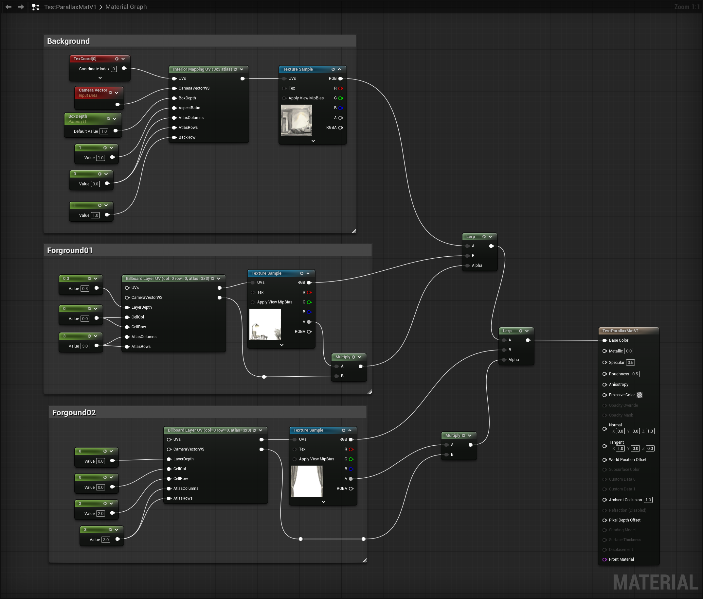

- **Flatten foreground first, then blend** — combine all foreground layers together first, then lerp the result over the background:\
  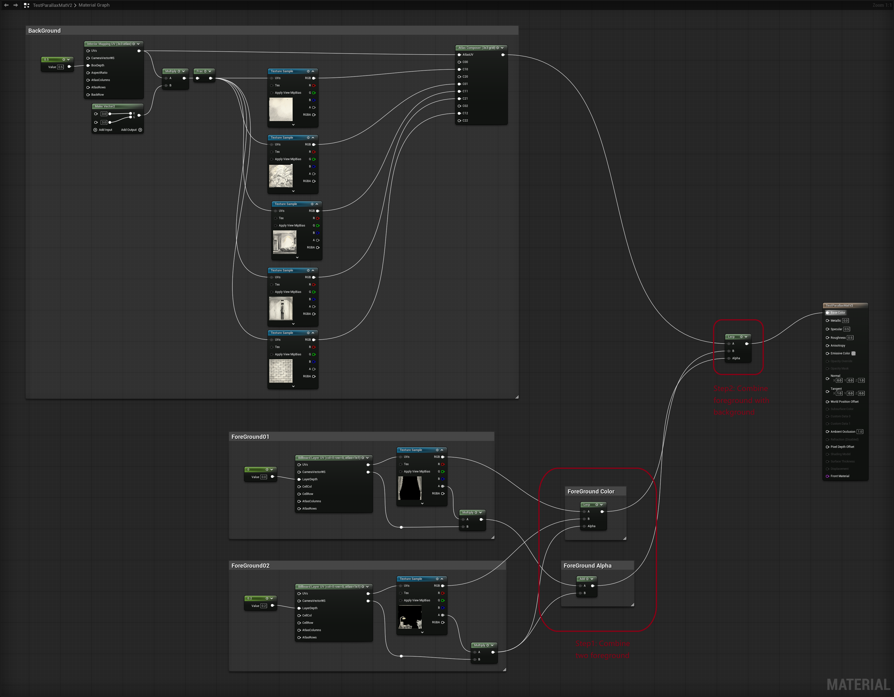

## Samples

Texture files: https://1drv.ms/f/c/53c607b8bea23158/IgDmN6ZhbhF_SIFqYHuihS8yAd4OvlsYO_YHI-Fe2mHs0Kk?e=DyZu2v

Sample Material: https://1drv.ms/f/c/53c607b8bea23158/IgAcOrITqqL9Rbpi2_DzZVFUAVaAHJgjyNPP6iRf4M7-bOM?e=ACCAZw

Copyable blueprint:
1. Nine-grid: https://blueprintue.com/blueprint/cwzojttp/
2. Individual texture: https://blueprintue.com/blueprint/fqkpjgb4/