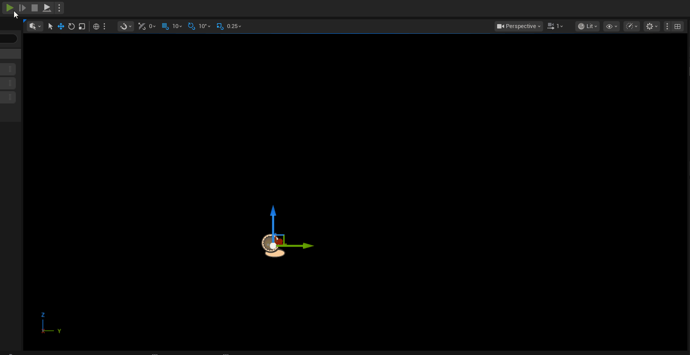
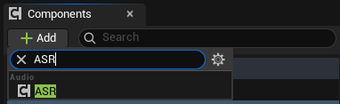
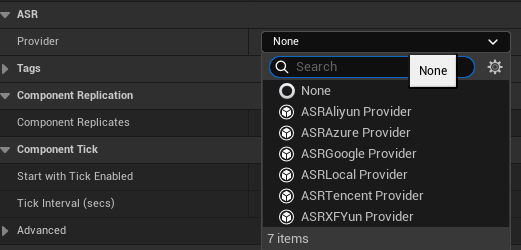
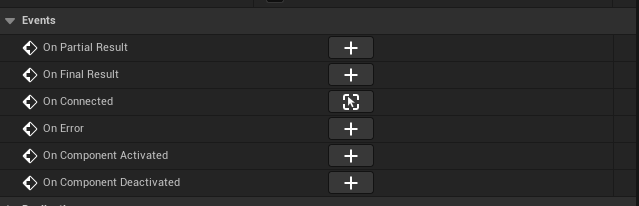
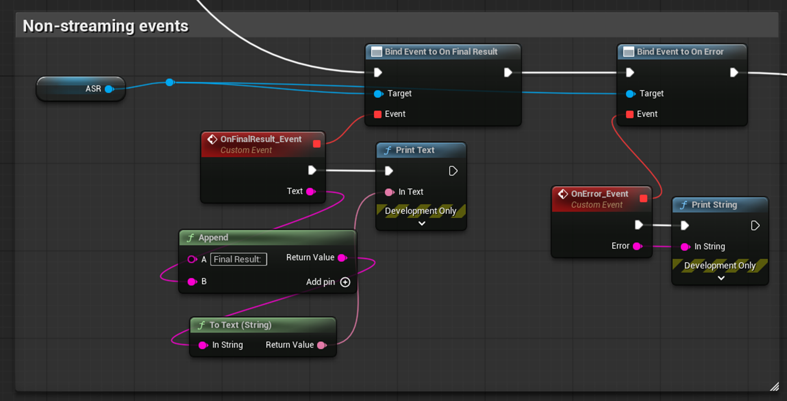
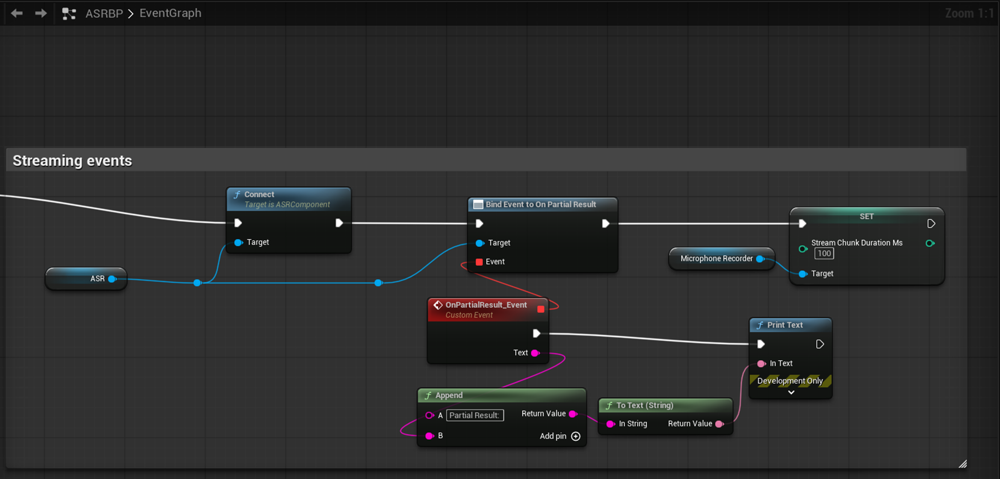
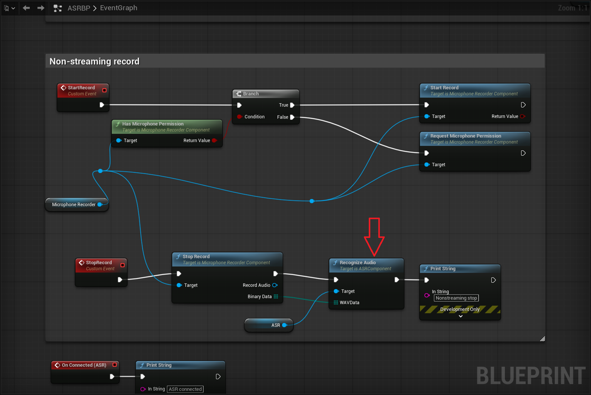
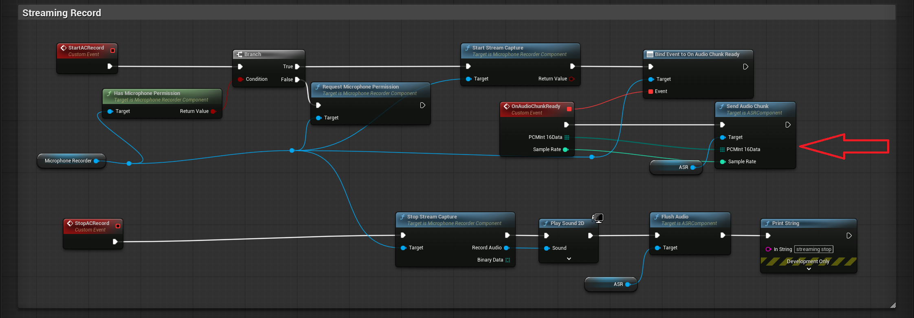

ASRWebSocket is a Unreal Engine 5.7 speech recognition (ASR) plugin that supports WebSocket and REST protocols for connecting to multiple cloud-based ASR providers, as well as local self-hosted ASR servers.

Sample files: 
- BP: https://github.com/bingothreed/LocalASRService/blob/main/UEBPs/MicrophoneRecorder/ASRBP.uasset
- BP UI: https://github.com/bingothreed/LocalASRService/blob/main/UEBPs/MicrophoneRecorder/ASRUI.uasset
- Copiable BP: https://blueprintue.com/blueprint/3kauq-ze/

> In the screenshot, the audio record part uses the Microphone Recorder plugin from Fab: https://www.fab.com/listings/67a6ae5a-69d1-46a8-b290-fa1815c43557
{: .prompt-tip }


---

## 0. Quick BP overview

1. Add `ASR` component \


2. Set `Provider` in details panel \


3. Bind events or create directly \

    - Non-streaming events for final result: \

    - Streaming events for chunk recognition: \


4. Recognition

- Non-streaming: send the final binary audio data to provider via `Recognize Audio` BP node: \


- Streaming: send audio chunk to provider one by one via `Send Audio Chunk` BP node:\



## 1. Features

| Feature | Description |
|---|---|
| **Multi-Provider Support** | Built-in support for Azure, Aliyun NLS, Google Cloud, Tencent Cloud, iFlytek (XFYun), and local servers |
| **Streaming Recognition** | Real-time audio streaming via WebSocket with partial and final result delivery |
| **Batch Recognition** | Send a complete WAV file for one-shot recognition |
| **Blueprint-Friendly** | All APIs exposed as `BlueprintCallable` / `BlueprintPure` / `BlueprintAssignable` via `UASRComponent` |
| **Runtime Provider Switching** | Dynamically swap ASR providers without recreating the component |
| **Auto Resampling** | Automatically resamples input PCM audio to 16 kHz mono Int16, compatible with `MicrophoneRecorder`'s `OnAudioChunkReady` signature |
| **WAV File Handling** | Automatic WAV header stripping and multi-channel-to-mono downmixing |

### Supported Providers

| Provider | Streaming | Batch | Auth Method |
|---|---|---|---|
| **Azure Speech** | WebSocket | REST | API Key |
| **Aliyun NLS** | WebSocket | REST | Static Token / AccessKey Auto-Fetch |
| **Google Cloud** | Buffered (pseudo-streaming) | REST | API Key |
| **Tencent Cloud** | WebSocket | REST (Flash) | SecretId + SecretKey (HMAC-SHA1) |
| **iFlytek XFYun** | WebSocket (IAT) | Simulated streaming | AppID + APIKey + APISecret (HMAC-SHA256) |
| **Local Server** | Raw WebSocket | Raw WebSocket | None |

---


## 2. Architecture

```
┌──────────────────────────────┐
│     UASRComponent             │
│  (ActorComponent, Blueprint)  │
│                               │
│  Blueprint Events:            │
│  - OnPartialResult(Text)      │
│  - OnFinalResult(Text)        │
│  - OnConnected()              │
│  - OnError(Error)             │
│                               │
│  Blueprint Functions:         │
│  - Connect / Disconnect       │
│  - SendAudioChunk / Flush     │
│  - RecognizeAudio             │
│  - SwitchProvider             │
│  - IsConnected                │
└──────────┬───────────────────┘
           │ Provider (Instanced)
           ▼
┌──────────────────────────────┐
│   UASRProviderBase (Abstract) │
│   - Connect()                │
│   - SendAudioChunk()         │
│   - FlushAudio()             │
│   - RecognizeAudio()         │
│   - Disconnect()             │
│   - IsConnected()            │
└──────────┬───────────────────┘
           │
    ┌──────┼──────┬────────┬──────────┬──────────┐
    ▼      ▼      ▼        ▼          ▼          ▼
  Azure  Aliyun Google Tencent   XFYun     Local
```

---

## 3. Provider Configuration Reference

### 3.1 Azure Speech (UASRAzureProvider)

Uses Azure Cognitive Services Speech-to-Text.

**Config struct**: `FAzureASRConfig`

| Parameter | Type | Default | Description |
|---|---|---|---|
| `APIKey` | `FString` | (empty) | Azure Speech service API key |
| `Region` | `FString` | (empty) | Azure region identifier. Common values: `"eastus"` (global), `"chinaeast2"` (China) |
| `Language` | `FString` | `"zh-CN"` | BCP-47 language code. Common values: `"zh-CN"` (Mandarin), `"en-US"` (US English) |
| `Mode` | `EAzureASRMode` | `Conversation` | Recognition mode. `Interactive` (short utterances), `Conversation` (conversation), `Dictation` (dictation) |

**Portal**: https://speech.microsoft.com/

---

### 3.2 Aliyun NLS (UASRAliyunProvider)

Uses Alibaba Cloud Intelligent Speech Interaction (NLS).

**Config struct**: `FAliyunASRConfig`

| Parameter | Type | Default | Description |
|---|---|---|---|
| `AppKey` | `FString` | (empty) | Aliyun NLS project AppKey |
| `Region` | `FString` | `"cn-shanghai"` | NLS gateway region. Common values: `"cn-shanghai"`, `"cn-beijing"` |
| `AuthMode` | `EAliyunAuthMode` | `StaticToken` | Authentication mode (see below) |
| `Token` | `FString` | (empty) | (Static Token mode) Pre-fetched NLS access token |
| `AccessKeyId` | `FString` | (empty) | (Auto Fetch mode) Aliyun account AccessKey ID |
| `AccessKeySecret` | `FString` | (empty) | (Auto Fetch mode) Aliyun account AccessKey Secret |

**Auth modes**:

| Mode | Description |
|---|---|
| `StaticToken` | Use a pre-fetched token. Manually fill in the `Token` field |
| `AutoFetch` | Use `AccessKeyId` + `AccessKeySecret` to automatically fetch tokens via HMAC-SHA1 signed requests. The plugin manages token refresh (refreshed 60 seconds before expiry) |

**Additional event** — `UASRAliyunProvider` only:

```cpp
UPROPERTY(BlueprintAssignable)
FOnAliyunTokenResult OnTokenFetched;
// Delegate signature: void(bool bSuccess, const FString& Info)
```
Fires when the auto-fetched token request completes (only in `AutoFetch` mode).

**Portal**: https://nls-portal.console.aliyun.com/applist

---

### 3.3 Google Cloud (UASRGoogleProvider)

Uses Google Cloud Speech-to-Text v1 REST API.

> **Note**: Streaming mode is not true WebSocket streaming. Audio chunks are buffered locally and submitted as a single synchronous recognition request when `FlushAudio()` is called. Results are delivered via `OnFinalResult` after `FlushAudio` returns.

**Config struct**: `FGoogleASRConfig`

| Parameter | Type | Default | Description |
|---|---|---|---|
| `APIKey` | `FString` | (empty) | Google Cloud API key |
| `LanguageCode` | `FString` | `"zh-CN"` | BCP-47 language code. Common values: `"zh-CN"`, `"en-US"` |
| `Model` | `FString` | (empty) | Optional model override. Options: `"latest_short"`, `"latest_long"`, `"command_and_search"`, `"chirp"`, etc. Leave empty for default |
| `bEnablePunctuation` | `bool` | `true` | Enable automatic punctuation |

**Portal**: https://console.cloud.google.com/apis/credentials

---

### 3.4 Tencent Cloud (UASRTencentProvider)

Uses Tencent Cloud ASR real-time (streaming) and Flash (batch) recognition.

**Config struct**: `FTencentASRConfig`

| Parameter | Type | Default | Description |
|---|---|---|---|
| `AppId` | `FString` | (empty) | Tencent Cloud AppID (numeric string) |
| `SecretId` | `FString` | (empty) | Tencent Cloud API SecretId |
| `SecretKey` | `FString` | (empty) | Tencent Cloud API SecretKey |
| `EngineModelType` | `FString` | `"16k_zh"` | Engine model type. Common values: `"16k_zh"`, `"8k_zh"`, `"16k_en"` |

> Authentication uses HMAC-SHA1 signing, computed automatically by the plugin.

**Streaming protocol**:
- Connects to `wss://asr.cloud.tencent.com/asr/v2/{AppId}`
- Sends 6400-byte PCM chunks (200ms @ 16 kHz)
- `slice_type=1` → OnPartialResult
- `slice_type=2` → OnFinalResult

**Batch protocol**: POST to `https://asr.cloud.tencent.com/asr/flash/v1/{AppId}` (Flash API)

---

### 3.5 iFlytek XFYun (UASRXFYunProvider)

Uses iFlytek IAT (Interactive Audio Transcription) service.

**Config struct**: `FXFYunASRConfig`

| Parameter | Type | Default | Description |
|---|---|---|---|
| `AppID` | `FString` | (empty) | iFlytek open platform application ID |
| `APIKey` | `FString` | (empty) | iFlytek API key |
| `APISecret` | `FString` | (empty) | iFlytek API secret |
| `Language` | `FString` | `"zh_cn"` | Language setting (currently only `"zh_cn"` is supported) |

> Authentication uses HMAC-SHA256 signing, connecting to `wss://iat-api.xfyun.cn/v2/iat`.

**Protocol notes**:
- First frame (status=0) contains common + business parameters
- Continue frames (status=1) carry audio data
- Last frame (status=2) signals end of audio
- Supports dynamic correction (pgs field), auto-concatenating segmented results

**Portal**: https://console.xfyun.cn/services/iat

---

### 3.6 Local Server (UASRLocalProvider)

Sample Local server with vosk and sherpa: https://github.com/bingothreed/LocalASRService/tree/main

Connects to a local self-hosted ASR server.

**Config struct**: `FLocalASRConfig`

| Parameter | Type | Default | Description |
|---|---|---|---|
| `ServerURL` | `FString` | `"ws://127.0.0.1:2700"` | WebSocket URL of the local ASR server |
| `TargetSampleRate` | `int32` | `16000` | Sample rate the server expects (Hz) |

**Server-side protocol requirements**:

Input:
- Binary frames: PCM Int16 mono audio
- JSON control frame: `{"command":"eof"}` — end of audio (maps to FlushAudio)
- JSON control frame: `{"command":"reset"}` — reset session (maps to Disconnect)
- Batch: raw WAV bytes (server auto-detects RIFF header)

Output (JSON):
```json
{"partial": "intermediate recognition result"}
{"text": "final recognition result"}
{"error": "error description"}
```

---

## 4. Core Nodes (UASRComponent)

### 4.1 BlueprintCallable Functions

#### Connect
```cpp
UFUNCTION(BlueprintCallable)
void Connect();
```
Connects to the ASR service. Automatically binds provider internal delegates to the component's Blueprint events.

**Typical flow**: `SwitchProvider → configure Provider parameters → Connect`

---

#### Disconnect
```cpp
UFUNCTION(BlueprintCallable)
void Disconnect();
```
Disconnects from the ASR service.

---

#### IsConnected
```cpp
UFUNCTION(BlueprintPure)
bool IsConnected();
```
Returns whether the provider is currently connected.

---

#### SendAudioChunk
```cpp
UFUNCTION(BlueprintCallable)
void SendAudioChunk(const TArray<uint8>& PCMInt16Data, int32 SampleRate);
```
Sends a chunk of mono PCM Int16 audio data.

| Parameter | Type | Description |
|---|---|---|
| `PCMInt16Data` | `TArray<uint8>` | Raw mono PCM Int16 byte data |
| `SampleRate` | `int32` | Sample rate of the input data (automatically resampled to 16 kHz internally) |

> Can be directly bound to MicrophoneRecorder's `OnAudioChunkReady` event.

---

#### FlushAudio
```cpp
UFUNCTION(BlueprintCallable)
void FlushAudio();
```
Signals end-of-speech so the provider can return the final recognition result for the current utterance.

---

#### RecognizeAudio
```cpp
UFUNCTION(BlueprintCallable)
void RecognizeAudio(const TArray<uint8>& WAVData);
```
Sends a complete WAV file for batch recognition.

| Parameter | Type | Description |
|---|---|---|
| `WAVData` | `TArray<uint8>` | Raw bytes of a complete WAV file |

> Internally strips WAV headers, mixes multi-channel to mono, and resamples to 16 kHz.

---

#### SwitchProvider
```cpp
UFUNCTION(BlueprintCallable)
void SwitchProvider(TSubclassOf<UASRProviderBase> ProviderClass);
```
Disconnects the current provider and instantiates a new one.

| Parameter | Type | Description |
|---|---|---|
| `ProviderClass` | `TSubclassOf<UASRProviderBase>` | Class reference for the target provider. Options: `UASRAzureProvider`, `UASRAliyunProvider`, `UASRGoogleProvider`, `UASRTencentProvider`, `UASRXFYunProvider`, `UASRLocalProvider` |

> After calling, cast the `Provider` property to the concrete type to configure its parameters, then call `Connect()`.

---

### 4.2 Blueprint Events

#### OnPartialResult
```cpp
UPROPERTY(BlueprintAssignable)
FOnASRPartialResult OnPartialResult;
// Delegate signature: void(const FString& Text)
```
Fires when an intermediate (non-final) recognition result arrives. The text may update as more audio data is received.

---

#### OnFinalResult
```cpp
UPROPERTY(BlueprintAssignable)
FOnASRFinalResult OnFinalResult;
// Delegate signature: void(const FString& Text)
```
Fires when a final recognition result arrives. Typically triggered after `FlushAudio()` or `RecognizeAudio()`.

---

#### OnConnected
```cpp
UPROPERTY(BlueprintAssignable)
FOnASRConnected OnConnected;
// Delegate signature: void()
```
Fires when the provider successfully connects to the ASR service.

---

#### OnError
```cpp
UPROPERTY(BlueprintAssignable)
FOnASRError OnError;
// Delegate signature: void(const FString& Error)
```
Fires when an error occurs. Contains the error description string.

---

### 4.3 Blueprint Property

#### Provider
```cpp
UPROPERTY(EditAnywhere, Instanced, BlueprintReadOnly)
UASRProviderBase* Provider;
```
The currently active ASR provider instance. Can be selected and configured directly in the Details panel.

---

## 5. Usage Examples (Blueprint)

### 5.1 Streaming Recognition

```
1. Add UASRComponent to your Actor
2. Select a Provider type (e.g., UASRAzureProvider) in the Details panel
3. Fill in the Provider's Config parameters (APIKey, Region, etc.)
4. Bind events OnPartialResult / OnFinalResult / OnConnected / OnError in Blueprint
5. Call Connect() to establish connection
6. Loop calling SendAudioChunk(PCMData, SampleRate) to stream audio
7. Call FlushAudio() to signal end of speech
8. Call Disconnect() after receiving results
```

### 5.2 Batch Recognition

```
1. Add UASRComponent and configure Provider parameters (same as above)
2. Bind OnFinalResult / OnError events
3. Load WAV file byte data
4. Call RecognizeAudio(WAVData)
5. Results are returned via OnFinalResult event
```

### 5.3 Runtime Provider Switching

```
1. Call SwitchProvider(UASRAzureProvider::StaticClass())
2. Cast Provider property to the concrete type
3. Set the new provider's Config parameters
4. Call Connect()
```

---

## 6. Supported Platforms

| Platform | Status |
|---|---|
| Win64 | Fully supported |
| Linux / LinuxArm64 | Fully supported |
| Mac | Fully supported |
| iOS | Fully supported |
| Android | Fully supported |

---

## 7. Module Dependencies

- **Core** — Core engine types
- **CoreUObject** — UObject system
- **Engine** — ActorComponent
- **HTTP** — REST requests (batch recognition, Aliyun token fetching)
- **WebSockets** — WebSocket streaming recognition
- **Json** — JSON parsing (all protocols)

---

## 8. Engine Version

Minimum requirement: **Unreal Engine 5.7**

---

## 9. Contact

Author: **BingoUE**

Provider portals:
- Azure: https://speech.microsoft.com/
- Aliyun: https://nls-portal.console.aliyun.com/applist
- Google Cloud: https://console.cloud.google.com/apis/credentials
- Tencent Cloud: https://console.cloud.tencent.com/asr
- iFlytek: https://console.xfyun.cn/services/iat
