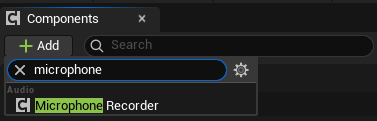
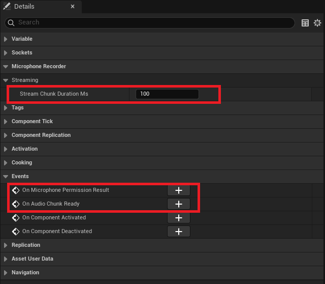
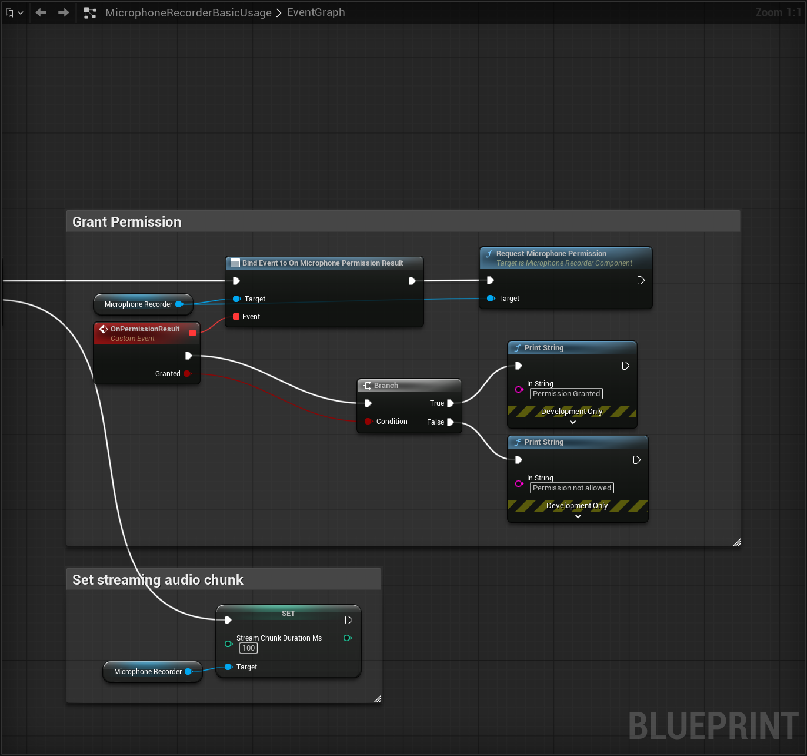
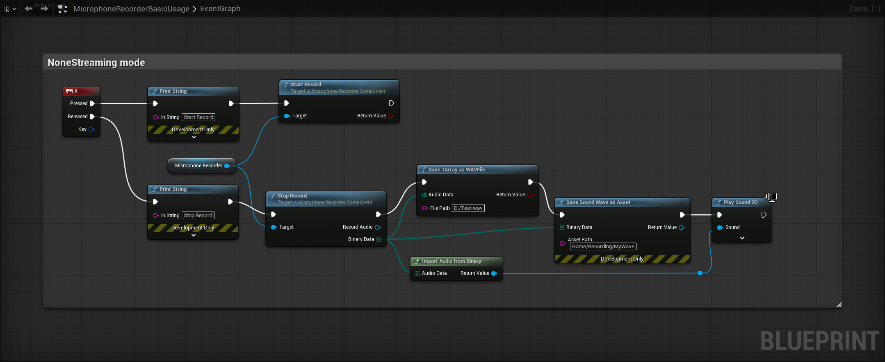
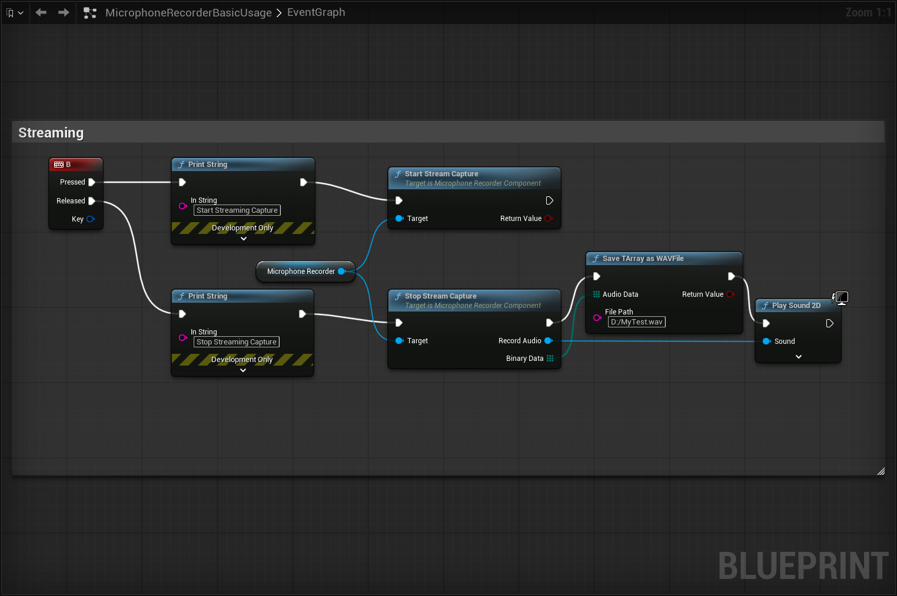
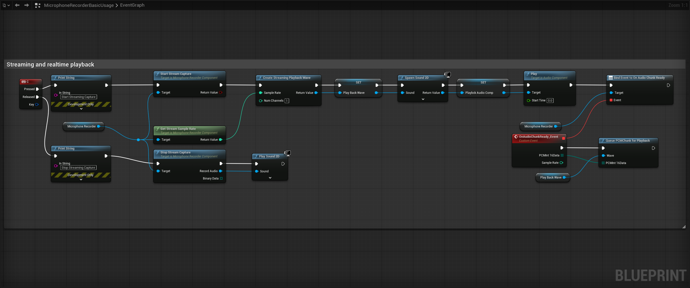

## 1. Introduction

MicrophoneRecorder is an Unreal Engine plugin that provides microphone recording, streaming audio capture, audio format conversion, and playback. All features are exposed as Blueprint nodes and can be used directly in the Blueprint editor.
It has the following features:
1. Streaming and non-streaming mode
2. Both USoundWave and PCM binary data are provided in the output pins.
3. The main user scenarios are streaming playback and cloud ASR audio (audio chunks) input.
4. Support Android/iOS/Win/Linux/Mac devices.

### 1.1 Sample files:

- Copiable blueprint sample can be found here: https://blueprintue.com/blueprint/n2oy88a2/

- Blueprint sample file can be found here: https://github.com/bingothreed/LocalASRService/blob/main/UEBPs/MicrophoneRecorder/MicrophoneRecorderBasicUsage.uasset

### 1.2 Component preview
1. Add `MicrophoneReocrder` component \


2. Details pannel preview \



### 1.3 Typical usage blueprint screenshots:

1. Grant permission \


2. Batch Recording \


3. Streaming Recording with chunks \


4. Streaming Recording with realtime playback \



## 2. UMicrophoneRecorderComponent

`BlueprintSpawnableComponent`. Add it to any Actor via "Add Component → Audio".

### 2.1 Permission

| Node | Signature | Type | Description |
|------|-----------|------|-------------|
| **Has Microphone Permission** | `bool HasMicrophonePermission() const` | `BlueprintPure` | Returns `true` if microphone permission is already granted. Always `true` on Windows/Linux/Mac |
| **Request Microphone Permission** | `void RequestMicrophonePermission()` | `BlueprintCallable` | Triggers the OS permission dialog on Android/iOS. Fires `OnMicrophonePermissionResult` when the user responds. Fires immediately on platforms that need no permission |

### 2.2 Batch Recording

Start once, stop once — get the complete recording.

| Node | Signature | Type | Description |
|------|-----------|------|-------------|
| **Start Record** | `bool StartRecord()` | `BlueprintCallable` | Starts batch recording. Returns `false` if no permission, if streaming is active, or if the audio device fails to initialize |
| **Stop Record** | `void StopRecord(USoundWave*& RecordAudio, TArray<uint8>& BinaryData)` | `BlueprintCallable` | Stops batch recording and returns the recorded audio as both a transient `USoundWave` and a WAV byte array |

> **Mutual exclusion**: batch recording and streaming capture cannot run simultaneously.

---

### 2.3 Streaming Capture

Captures audio continuously and delivers it in real-time chunks.

| Node | Signature | Type | Description |
|------|-----------|------|-------------|
| **Start Stream Capture** | `bool StartStreamCapture()` | `BlueprintCallable` | Starts streaming capture. Fires `OnAudioChunkReady` each time a chunk duration elapses. Returns `false` if already streaming, no permission, or batch recording is active |
| **Stop Stream Capture** | `void StopStreamCapture(USoundWave*& RecordAudio, TArray<uint8>& BinaryData)` | `BlueprintCallable` | Stops streaming and returns the full accumulated recorded audio as both a `USoundWave` and WAV byte array |
| **Is Stream Capturing** | `bool IsStreamCapturing() const` | `BlueprintPure` | Returns whether streaming capture is currently active |
| **Get Stream Sample Rate** | `int32 GetStreamSampleRate() const` | `BlueprintPure` | Returns the sample rate of the streaming capture (thread-safe) |
| **Get Stream Num Channels** | `int32 GetStreamNumChannels() const` | `BlueprintPure` | Returns the number of channels in the streaming capture (thread-safe) |

---

### 2.4 Delegates

| Delegate | Signature | Trigger |
|----------|-----------|---------|
| **On Microphone Permission Result** | `FOnMicPermissionResult(bool bGranted)` | Fired when the user responds to the microphone permission dialog. `bGranted` indicates whether permission was granted |
| **On Audio Chunk Ready** | `FOnAudioChunkReady(const TArray<uint8>& PCMInt16Data, int32 SampleRate)` | Fired on the game thread each time a PCM chunk is ready during streaming capture. Data is mono int16 little-endian at the native device sample rate |

---

### 2.5 Configurable Properties

| Property | Type | Default | Description |
|----------|------|---------|-------------|
| **Stream Chunk Duration Ms** | `int32` (BlueprintReadWrite) | 100 | Duration of each chunk delivered via `OnAudioChunkReady`, in milliseconds |

---

## 3. UAudioUtils (Audio Utility Function Library)

`UBlueprintFunctionLibrary`. All methods are static and can be called directly in Blueprints.

### 3.1 Import / Export / Conversion

| Node | Signature | Type | Description |
|------|-----------|------|-------------|
| **Import Audio From Binary** | `USoundWave* ImportAudioFromBinary(const TArray<uint8>& AudioData)` | `BlueprintPure` | Imports a WAV byte array into a transient `USoundWave`. Returns `nullptr` on failure |
| **Sound Wave To Bytes** | `TArray<uint8> SoundWaveToBytes(const USoundWave* Audio)` | `BlueprintPure` | Serialises a `USoundWave`'s RawPCMData into a WAV byte array |
| **Convert Record** | `TArray<uint8> ConvertRecord(const TArray<uint8>& PCMBytes, int32 SampleRate = 48000, int32 NumChannels = 1, int32 BitDepth = 16)` | `BlueprintPure` | Wraps raw PCM bytes in a WAV header. No sample-rate conversion is performed |
| **Resample PCM Int16** | `TArray<uint8> ResamplePCMInt16(const TArray<uint8>& PCMInt16Data, int32 SourceRate, int32 TargetRate)` | `BlueprintPure` | Resamples mono int16 PCM from source rate to target rate using linear interpolation. Suitable for downsampling speech audio before ASR (e.g. 48000 Hz to 16000 Hz). Returns input unchanged if rates are equal |
| **Save TArray As WAV File** | `bool SaveTArrayAsWAVFile(const TArray<uint8>& AudioData, const FString& FilePath)` | `BlueprintCallable` | Writes a WAV byte array directly to a file on disk. Returns whether the write succeeded |
| **Save Sound Wave As Asset** | `USoundWave* SaveSoundWaveAsAsset(const TArray<uint8>& BinaryData, const FString& AssetPath)` | `BlueprintCallable` | Saves WAV binary data into the Content Browser as a persistent `.uasset`. AssetPath is the full content path, e.g. `"/Game/Recordings/MySound"`. **Editor-only** (`DevelopmentOnly`); returns `nullptr` at runtime |

---

### 3.2 Real-time Playback

| Node | Signature | Type | Description |
|------|-----------|------|-------------|
| **Create Streaming Playback Wave** | `USoundWaveProcedural* CreateStreamingPlaybackWave(int32 SampleRate, int32 NumChannels = 1)` | `BlueprintCallable` | Creates a `USoundWaveProcedural` ready to receive streaming PCM chunks. Use with `SpawnSound2D` to start playback |
| **Queue PCM Chunk For Playback** | `void QueuePCMChunkForPlayback(USoundWaveProcedural* Wave, const TArray<uint8>& PCMInt16Data)` | `BlueprintCallable` | Queues one PCM chunk (mono int16 raw bytes) into a procedural wave for playback. Typically called inside `OnAudioChunkReady` for seamless streaming audio output |

---

## 4. Typical Blueprint Usage Flows

### Batch Recording
```
HasMicrophonePermission → RequestMicrophonePermission → [wait for OnMicrophonePermissionResult]
→ StartRecord → ... → StopRecord → (optional) ImportAudioFromBinary / SaveTArrayAsWAVFile
```

### Streaming Capture + Real-time Playback
```
HasMicrophonePermission → RequestMicrophonePermission → [wait for OnMicrophonePermissionResult]
→ CreateStreamingPlaybackWave → SpawnSound2D
→ StartStreamCapture → [call QueuePCMChunkForPlayback in OnAudioChunkReady callback]
→ StopStreamCapture → SaveTArrayAsWAVFile
```

### Speech Recognition Preprocessing
```
... → StopRecord → ResamplePCMInt16 (48000 → 16000) → ConvertRecord → feed to ASR interface
```

---

## 5. Node Index by Category

| Category | Nodes |
|----------|-------|
| `MicrophoneRecorder\|Permission` | `HasMicrophonePermission`, `RequestMicrophonePermission`, `OnMicrophonePermissionResult` |
| `MicrophoneRecorder` | `StartRecord`, `StopRecord`, `ImportAudioFromBinary`, `ConvertRecord`, `SoundWaveToBytes`, `ResamplePCMInt16`, `SaveTArrayAsWAVFile`, `SaveSoundWaveAsAsset` |
| `MicrophoneRecorder\|Streaming` | `StartStreamCapture`, `StopStreamCapture`, `IsStreamCapturing`, `GetStreamSampleRate`, `GetStreamNumChannels`, `OnAudioChunkReady`, `StreamChunkDurationMs` |
| `MicrophoneRecorder\|Playback` | `CreateStreamingPlaybackWave`, `QueuePCMChunkForPlayback` |

---

**Plugin Version:** 1.0 | **Engine Version:** 5.7.0/5.6.0/5.5.0 | **Platforms:** Win64 / Linux / LinuxArm64 / Mac / iOS / Android

