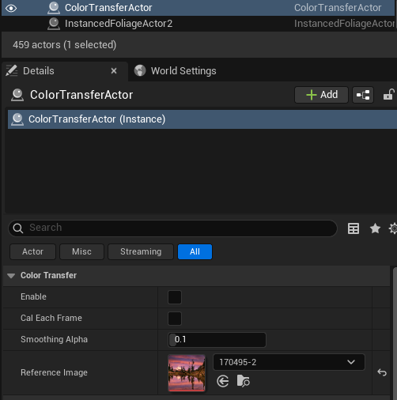
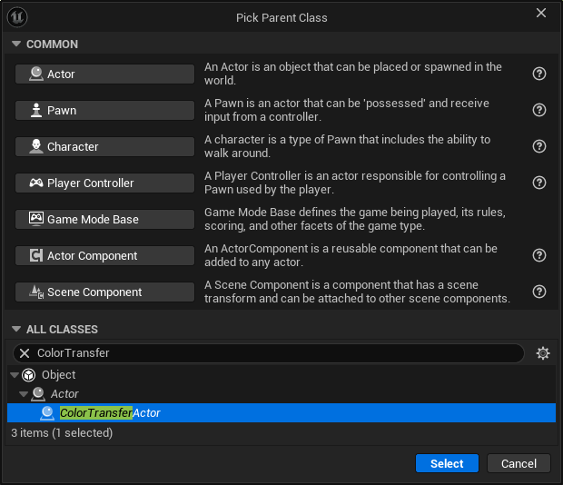
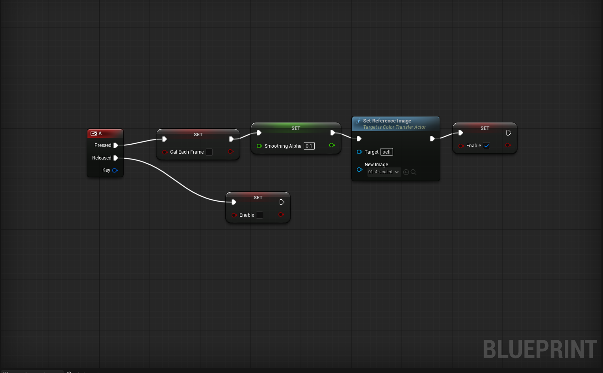
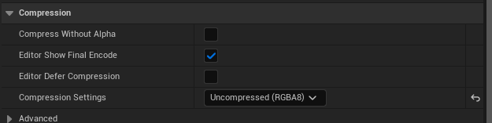

## 1. Introduction

ColorTransfer is an Unreal Engine plugin that performs real-time color transfer between images. Given a reference image, it transfers the color style to the scene viewport in real time.

It has the following features:

1. Real-time color transfer applied as a post-process pass
2. Reference image hot-swap at runtime via Blueprint
3. EMA smoothing to suppress flicker
4. Works in editor viewport, PIE, and packaged builds
5. Support Android / iOS / Win64 / Linux / LinuxArm64 / Mac

### 1.1 Quick Start

#### 1.1.1 Direct way
1. Install the plugin and enable it in Plugins window
2. Place a **ColorTransferActor** in the level (found in the Place Actors panel under VFX category)
3. Assign a **ReferenceImage** texture to the actor
4. Check **Enable** to activate the effect



#### 1.1.2 New BP inherent from ColorTransferActor






---

## 2. AColorTransferActor

Place a `ColorTransferActor` in your level. It drives the color transfer effect for the entire scene.

### 2.1 Properties

| Property | Type | Default | Description |
|----------|------|---------|-------------|
| **Enable** | `bool` | `false` | Toggles the effect on/off. Can be changed at runtime via `SetEnable()` |
| **Cal Each Frame** | `bool` | `false` | When `true`, reference stats are re-computed every frame (useful for animated reference textures). When `false`, stats are cached after first computation |
| **Smoothing Alpha** | `float` (0.0–1.0) | `0.1` | Smoothing factor for scene statistics. `0.0` = frozen, `1.0` = instant (may flicker). Recommended: `0.05` ~ `0.2` |
| **Reference Image** | `UTexture2D*` | `nullptr` | The reference image whose color style will be transferred to the scene |

### 2.2 Blueprint Functions

| Node | Signature | Type | Description |
|------|-----------|------|-------------|
| **Set Enable** | `void SetEnable(bool bEnable)` | `BlueprintCallable` | Enables or disables the effect at runtime |
| **Set Reference Image** | `void SetReferenceImage(UTexture2D* NewImage)` | `BlueprintCallable` | Swaps the reference image at runtime |

### 2.3 Typical Blueprint Usage

```
SetReferenceImage(NewStyleTexture) → SetEnable(true)
```

---

## 3. Reference Image Requirements

The reference image texture must meet these requirements:

| Requirement | Value |
|-------------|-------|
| **Format** | RGBA8 |
| **Compression** | Uncompressed(RGBA8) |


If the format is incorrect, the plugin will log a warning:
```
reference texture 'MyTexture' is not PF_B8G8R8A8 — import with no compression and no alpha override.
```

---

## 4. Logging

The plugin logs to the `LogColorTransfer` category. Verbose logs are disabled by default.

Enable verbose logging via console command:
```
Log LogColorTransfer Verbose
```

Or in `DefaultEngine.ini`:
```ini
[Core.Log]
LogColorTransfer=Verbose
```

---

## 5. Platform Notes

On mobile (Android / iOS), the transfer pass is applied after Tonemap instead of MotionBlur.

---

## 6. Troubleshooting

- **Effect doesn't appear**: Ensure **Enable** is checked and a valid **Reference Image** (BGRA8, uncompressed) is assigned. Wait one frame after enabling.
- **Flickering**: Lower **Smoothing Alpha** (e.g. `0.05`).

---

**Plugin Version:** 1.0 | **Engine Version:** 5.7/5.6/5.5 | **Platforms:** Win64 / Linux / LinuxArm64 / Mac / iOS / Android
